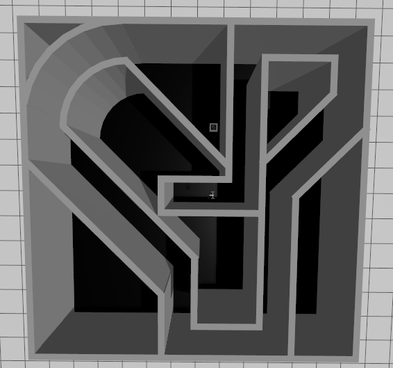

# drone-aruco-docking

ROS 2 Jazzy + Gazebo simulation for a drone that searches for ArUco markers and lands on the docking pad. The project includes two mission modes:

- `coverage_run.launch.py`: coverage-style search over an open arena.
- `maze_run.launch.py`: maze flight with lidar-based obstacle avoidance and ArUco docking.

The docking target is ArUco ID `50`.

## Demo

[Watch the demo video](docs/Demo-drone-docking.mp4)



## Quick Start

```bash
xhost +local:docker
docker compose up
```

This starts Gazebo, RViz, the ROS-Gazebo bridge, the drone model, and the default maze docking mission.

## Mission Modes

### Coverage Mission

`coverage_run.launch.py` runs the drone in an open arena. The drone follows a zigzag coverage path, scans the ground with the downward camera, and switches to docking when it detects ArUco ID `50`.

### Maze Mission

`maze_run.launch.py` runs the drone in a maze. The drone uses lidar to avoid walls while searching, then uses the same ArUco-centering logic to align with ID `50` and land.

## Mission Flow

```text
Take off -> search -> detect ArUco ID 50 -> center marker in camera -> descend -> land
```

The drone uses a downward camera for ArUco detection. During docking, it first moves in `x/y` to place the marker near the image center, then descends toward the pad.

## Marker IDs

```text
ID 50  docking pad
ID 42  bomb marker / no landing
ID 23  supply marker
ID 3   extra arena marker
ID 65  extra arena marker
```

## Project Layout

```text
workspace/src/drone_scene      Gazebo worlds, drone xacro, bridge config, RViz config
workspace/src/drone_control    ROS 2 Python nodes and launch files
docs/                          demo video and thumbnail
Dockerfile                     Docker image definition
docker-compose.yaml            one-command Docker run workflow
```

## Run With Docker

The Docker image is published as:

```bash
quanmh25/drone_aruco_docking:latest
```

Allow Docker containers to open Gazebo/RViz windows:

```bash
xhost +local:docker
```

Run the default maze mission:

```bash
docker compose up
```

Run the coverage mission instead:

```bash
LAUNCH_FILE=coverage_run.launch.py docker compose up
```

Run with a temporary container that is removed after exit:

```bash
docker compose run --rm ros
```

Stop and remove the compose service container:

```bash
docker compose down
```

## Build And Push Docker Image

Build the image from the repository root:

```bash
docker build -t quanmh25/drone_aruco_docking:latest .
```

Push it to Docker Hub:

```bash
docker login
docker push quanmh25/drone_aruco_docking:latest
```

## Run Natively

Install ROS 2 Jazzy and the required Gazebo/ROS packages, then build:

```bash
cd workspace
source /opt/ros/jazzy/setup.bash
colcon build --symlink-install
source install/setup.bash
```

Run the maze mission:

```bash
ros2 launch drone_control maze_run.launch.py
```

Run the coverage mission:

```bash
ros2 launch drone_control coverage_run.launch.py
```

## Useful Topics

```bash
/cmd_vel             drone velocity command
/odom                drone odometry
/camera/image_raw    downward camera image
/camera/camera_info  camera calibration info
/scan                lidar scan
```

## Troubleshooting

If Gazebo/RViz windows do not open, run:

```bash
xhost +local:docker
```

If Docker build is slow, use the published image and run:

```bash
docker compose up
```

If `colcon build` reports a `CMakeCache.txt` path mismatch, clean the local build artifacts once:

```bash
rm -rf workspace/build workspace/install workspace/log
docker compose run --rm ros
```

If ROS still launches old code after edits, rebuild and source again:

```bash
cd workspace
colcon build --symlink-install
source install/setup.bash
```
